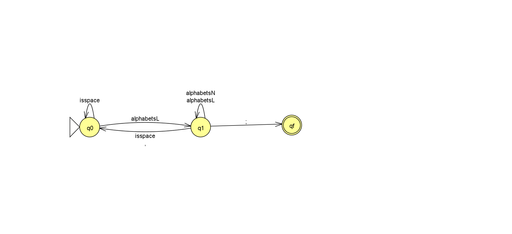

# automaton-dfa

- Implementação de um Autômato Finito Determinístico (AFD) em C++


## Demonstração do Autômato



- alphabetsL = {'a', 'b', 'c', 'd', 'e', 'f', 'g', 'h', 'i', 'j', 'k', 'l', 'm', 'n', 'o', 'p', 'q', 'r', 's', 't', 'u', 'v', 'w', 'x', 'y', 'z', 'A', 'B', 'C', 'D', 'E', 'F', 'G', 'H', 'I', 'J', 'K', 'L', 'M', 'N', 'O', 'P', 'Q', 'R', 'S', 'T', 'U', 'V', 'W', 'X', 'Y', 'Z', '_', '$', ',', ';'}

- alphabetsN = {'1', '2', '3', '4', '5', '6', '7', '8', '9', '0'}

- Os métodos de transições e execução do autômato estão no arquivo Automaton.cpp

## Estados do Autômato

- q0 (estado inicial)
- q1
- qf (estado final)


## Como Compilar e Executar

- Para executar o programa, encontre o arquivo main.cpp e execute através do comando:

```bash
  ./main
```

## Autores

- Gabriel Ribeiro
- Fellipe Machado Castro
- Amanda Alcantara
